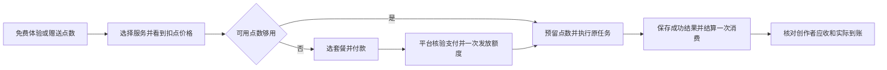

# Agent Payment Kit

把已有 Agent 经营成收费服务：用户先免费体验，再购买服务额度，使用时按明确规则扣点，创作者能核对自己的收入和到账。

这是一套随 Combo Agent SDK 分发的**商业设计与接入交接包**，参考 ChatGua 的公开付费设计。它包含可复制的配置、流程、平台与 SDK 分工以及验收表。套餐购买、业务点数账本和创作者收款是待实现的商业能力，跟踪 [Combo #357](https://github.com/dangdang-tech/Combo/issues/357)；当前 SDK 已有的托管支付能力见[支付使用手册](../../PAYMENT_SDK_INTEGRATION.md)。

## 先理解这套收费方式

例如，创作者已有一个咨询 Agent。用户可以免费建档，完成新手任务获得少量试用点数；随后选择标准服务或高级服务，每次分别扣固定点数。点数不足时购买套餐，到账后继续原任务。一次服务内部可能调用多个模型和工具，用户仍按已确认的服务价格支付一次。



“付款成功”“服务完成”“创作者收到钱”分别有独立证据。免费点数、购买点数、未消费余额、模型成本、创作者应收不能混成一个余额。

## 包里有什么

| 文件 | 用法 |
| --- | --- |
| [ChatGua 参考](chatgua-reference.md) | 价格、免费体验、扣点与支付路径；每项保留来源和验证层级。 |
| [商业规则](commercial-contract.md) | 套餐、点数、服务消费、重试、退款和创作者收款的设计合同。 |
| [接入分工](integration.md) | 当前 SDK 能直接复用什么，平台还需实现什么；给编码 Agent 的交接步骤。 |
| [配置模板](catalog.example.json) | 一个创作者、一个 Agent、一种币种、一个套餐的虚构草案。 |
| [配置 Schema](catalog.schema.json) | 对模板做结构检查；这是 kit 配置格式，不是已上线的支付 API。 |
| [验收表](acceptance.md) | 离线检查、平台测试、陌生接入者验收与真实收款分别记录。 |

## 复制并开始设计

从包含本目录的锁定提交或安装包开始。SDK 根 README 的旧安装 SHA 不包含此 kit；交接时应提供本次 PR 合并后的完整 SHA 或经校验的工件，不只提供 `0.1.1` 文件名。

```bash
# 已安装包含 kit 的 SDK 工件后，在你的应用目录执行。
mkdir -p agent-payment-kit
cp node_modules/combo-agent-sdk/kits/payment-kit/catalog.example.json ./agent-payment-kit/catalog.json
cp node_modules/combo-agent-sdk/kits/payment-kit/catalog.schema.json ./agent-payment-kit/catalog.schema.json
```

先改复制出的 `catalog.json` 中的创作者、Agent、套餐金额、点数和服务价格，再按商业规则定下过期、退款与收款路径。其余说明文档继续从完整 SDK 工件或仓库阅读，以保留到 SDK 手册的相对链接。模板的 **¥19 / 110 点、免费 10 点、标准 2 点、高级 10 点均为虚构演示配置**，不是 ChatGua 的人民币换算，也不是 Combo 已承诺的售价。`draft` 与 `undecided` 表示待确认，不能据此开启收费。

在 SDK 源码仓运行配置检查，无需账号或网络调用：

```bash
pnpm install --frozen-lockfile
pnpm verify:payment-kit
# 检查你修改后的文件；相对路径以当前工作目录为准。
pnpm verify:payment-kit -- /absolute/path/to/catalog.json
```

检查脚本使用仓库开发依赖，不随生产 SDK 安装；消费方可用支持 JSON Schema draft-07 的工具读取随包 Schema，并落实[跨字段约束](commercial-contract.md#配置约束)。PASS 仅表示草案配置有效，不表示可创建订单或扣款。

## 最小落地顺序

1. 确认服务收费边界、收款主体和点数适用范围，完成配置草案。无需先做商城、订阅或提现 UI。
2. 平台实现套餐、可信支付确认、点数账本与通用业务消费合同。金额与点数只能由平台权威配置决定。
3. Host 展示套餐、余额、每次服务价格和支付状态；Agent 保存原业务请求与结果，并接入平台的业务消费合同。
4. 按验收表完成并发、重复回调、失败与恢复检查，再做陌生接入者和真实交易验收。

开发可直接推进离线配置和合同设计。真实收款测试需要对应环境、付款方和收款方的明确授权；当前 kit 没有发起此类操作。
